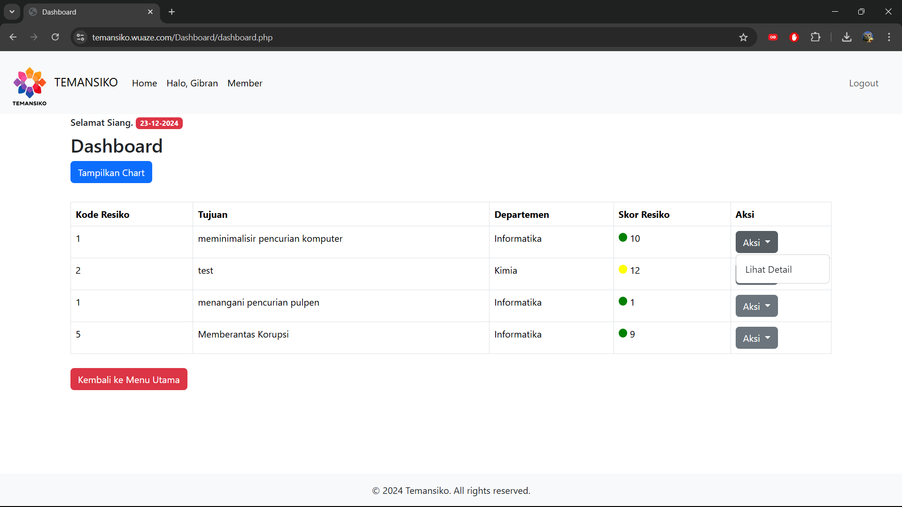

# TEMANSIKO


## Overview

TEMANSIKO is a risk management application that helps you manage risks easily, organized, and without hassle. With TEMANSIKO, you can handle risks effectively and live more peacefully!

## Features

- User authentication (Login/Register)
- Role-based access control (Admin/User)
- Risk management (Add, Edit, View, Delete)
- Risk visualization (Scatter Plot Chart)
- User profile management
- Member list

## Setup Instructions

1. **Clone the repository:**
    ```bash
    git clone https://github.com/hanipubaidur/Temansiko.git
    ```

2. **Navigate to the project directory:**
    ```bash
    cd Temansiko
    ```

3. **Set up the database:**
    - Create a database named `project_bbp`:
        ```sql
        CREATE DATABASE project_bbp;
        ```
    - Create the `users` table:
        ```sql
        CREATE TABLE users (
            id INT AUTO_INCREMENT PRIMARY KEY,
            username VARCHAR(50) NOT NULL,
            password VARCHAR(255) NOT NULL,
            role ENUM('admin', 'user') NOT NULL,
            register_date DATETIME NOT NULL,
            last_login DATETIME DEFAULT NULL,
            login_count INT DEFAULT 0
        );
        ```
    - Create the `risks` table:
        ```sql
        CREATE TABLE risks (
            id INT AUTO_INCREMENT PRIMARY KEY,
            risk_code INT NOT NULL,
            title VARCHAR(255) NOT NULL,
            description TEXT NOT NULL,
            business_process VARCHAR(50) NOT NULL,
            risk_group VARCHAR(50) NOT NULL,
            source VARCHAR(50) NOT NULL,
            event_description TEXT NOT NULL,
            risk_cause TEXT NOT NULL,
            risk_owner VARCHAR(50) NOT NULL,
            department VARCHAR(50) NOT NULL,
            inherent_likelihood INT NOT NULL,
            inherent_impact INT NOT NULL,
            control_exists VARCHAR(50) NOT NULL,
            control_adequate VARCHAR(50) NOT NULL,
            control_status VARCHAR(50) NOT NULL,
            residual_likelihood INT NOT NULL,
            residual_impact INT NOT NULL,
            mitigation_action TEXT NOT NULL,
            treatment VARCHAR(50) NOT NULL,
            mitigation_likelihood INT NOT NULL,
            mitigation_impact INT NOT NULL,
            objective VARCHAR(255) NOT NULL,
            potential_loss_qualitative TEXT NOT NULL,
            potential_loss_financial INT NOT NULL,
            created_by INT NOT NULL,
            created_at DATETIME NOT NULL,
            updated_at DATETIME DEFAULT NULL
        );
        ```
    - Update the database configuration in `lib/db.php` with your database credentials.

4. **Start the server:**
    - If using XAMPP, place the project folder in the `htdocs` directory.
    - Start Apache and MySQL from the XAMPP control panel.
    - Access the application in your browser at `http://localhost/Temansiko`.

## Usage

- **Home Page:** Provides an introduction to TEMANSIKO and navigation links.
- **Profile Page:** Displays user profile information and options to add or view risks.
- **Member Page:** Lists all registered members.
- **Dashboard:** Admin-only page to manage risks.
- **Add Risk:** Form to add new risks.
- **Edit Risk:** Form to edit existing risks.
- **Show Chart:** Visualizes risks using a scatter plot chart.

## How to Register and Login

### Register
- **User:** 
  - Username: Any username
  - Password: Any password
- **Admin:** 
  - Username: Any username
  - Password: `admin1234`

### Login
- Use the registered username and password to login.

## Screenshots

### Home Page


### Home Page


### Home Page


### Admin


### Admin


### User


### User


## License

&copy; 2024 Temansiko. All rights reserved.

## Contact

For any inquiries or support, please contact us at [hanifurohman05@gmail.com](mailto:hanifurohman05@gmail.com) and/or follow us on Instagram [@nip.niff](https://instagram.com/nip.niff).
